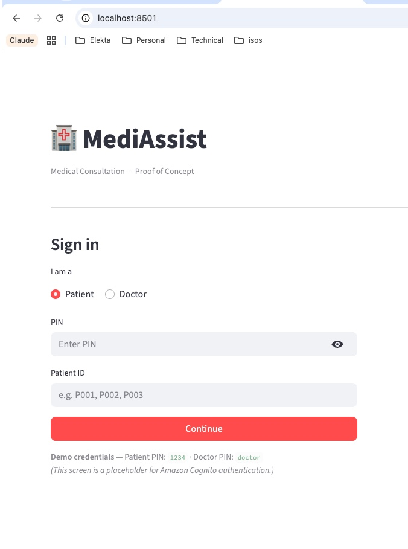
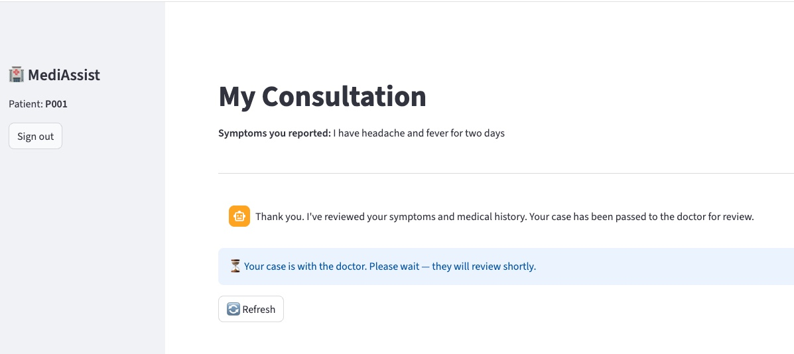
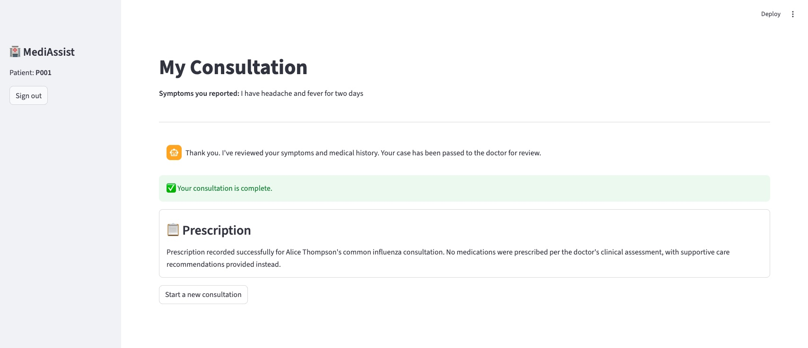
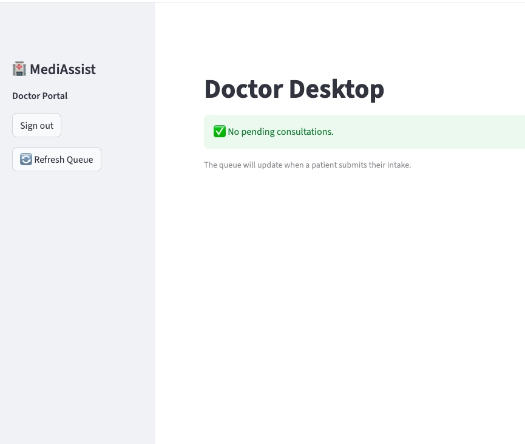

# Demo Walkthrough

A complete consultation from patient login to prescription — using Patient P001 (Alice Thompson, headache and fever) as the example.

---

## 1. Login

Open `http://localhost:8501`. Select a role and enter the demo PIN.

| Role | PIN | Patient ID |
|------|-----|------------|
| Patient | `1234` | `P001`, `P002`, or `P003` |
| Doctor | `doctor` | — |

> This screen is a placeholder for Amazon Cognito. The PIN is hardcoded; no real authentication takes place.

---

## 2. Patient submits symptoms — AI intake runs

The patient types their symptoms and clicks **Start Consultation**. The intake agent:

- Fetches the patient's record and medical history from SQLite
- Searches the knowledge base for relevant clinical context
- Produces an intake summary and assigns a **triage score (1–5)**
- Hands off to the doctor queue

The patient sees a confirmation message and a status banner: *"Your case is with the doctor."*

The graph is now paused at the `doctor_review` interrupt node. Nothing happens until the doctor acts.

---

## 3. Doctor reviews the case

In a separate browser tab, the doctor logs in with PIN `doctor`. The queue shows all pending consultations sorted by triage severity.

The doctor sees:

- **Triage badge** — 🟡 Level 3 (Moderate) with the AI's one-line reasoning
- **Intake summary** — clinical context drawn from the patient's history, allergies, and the knowledge base
- **Your Response panel** — two actions:
  - **Submit Diagnosis** — enters notes and clicks the red button; the prescription agent takes over
  - **Ask Patient** — sends a clarifying question back to the patient's chat window before diagnosing

In this example the doctor diagnoses *common flu, no medication needed* and submits.

---

## 4. Patient receives the prescription

The prescription agent checks pharmacy inventory, then writes and records the prescription. The patient's view updates automatically.

The green banner confirms the consultation is complete. The prescription card shows the outcome — in this case, supportive care only (no medication prescribed).

---

## 5. Doctor queue clears

Back on the Doctor Desktop, the queue shows no pending consultations.

---

## What to try next

| Scenario | How to trigger |
|----------|---------------|
| **Emergency path** | Log in as P001 and report chest pain radiating to the left arm — the patient sees an immediate red emergency banner; no doctor queue entry is created |
| **Clarification loop** | As the doctor, use "Ask Patient" instead of submitting a diagnosis — the patient's tab shows the doctor's question; answering it routes back to the doctor before prescription |
| **Out-of-stock pharmacy** | The prescription agent will flag Amoxicillin as out of stock (seeded with zero quantity) and suggest an alternative |
| **Multilingual intake** | Submit symptoms in French or Spanish — the intake agent responds in the same language; the intake summary for the doctor is always in English |
